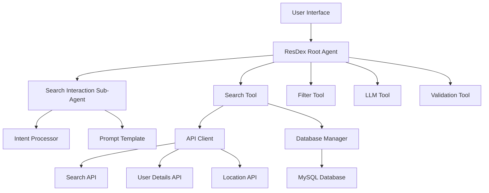
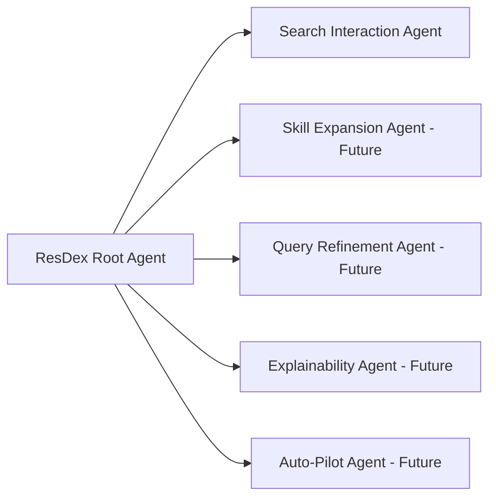
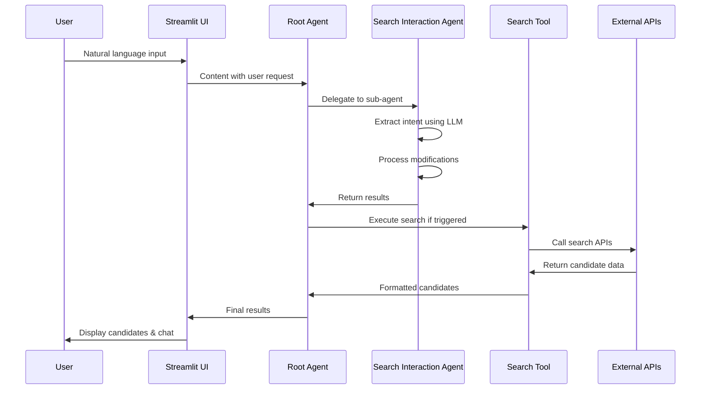

# ResDex Agent Architecture

## System Overview



## Agent Hierarchy



## Data Flow



This complete codebase provides:

1. **Google ADK Compliant Structure**: Follows the exact patterns from Google's ADK samples
2. **Modular Design**: Clean separation between agents, tools, and utilities  
3. **Complete Working System**: All your original functionality preserved but restructured
4. **Extensible Framework**: Easy to add the 4 future agents you mentioned
5. **Production Ready**: Includes deployment, testing, and evaluation frameworks
6. **Your API Integration**: Uses all your existing API credentials and endpoints

## Roadmap for Future Agents

Based on the new structure, here's how the 4 future agents would fit:

### Agent II - Skill & Title Expansion Agent
```python
# resdx_agent/sub_agents/skill_expansion/agent.py
class SkillExpansionAgent(Agent):
    """Expands skills using Vedansh's utilities, clusters related skills"""
```

### Agent III - Query Refinement Agent  
```python
# resdx_agent/sub_agents/query_refinement/agent.py
class QueryRefinementAgent(Agent):
    """Refines vague queries for better semantic matching"""
```

### Agent IV - Explainability Agent
```python
# resdex_agent/sub_agents/explainability/agent.py
class ExplainabilityAgent(Agent):
    """Explains candidate matches and summarizes resumes"""
```

### Agent V - Auto-Pilot Agent
```python
# resdex_agent/sub_agents/auto_pilot/agent.py
class AutoPilotAgent(Agent):
    """Autonomously evaluates and refines search results"""
```

The agents would be automatically discovered and initialized by the root agent based on configuration.

To run the complete system:

```bash
# 1. Setup
git clone <your-repo>
cd resdex-agent
poetry install
cp .env.example .env
# Edit .env with your credentials

# 2. Run
poetry shell
streamlit run resdex_agent/ui/streamlit_app.py

# 3. Test
poetry run pytest
poetry run python eval/test_eval.py
```

This gives you a production-ready, Google ADK-compliant agent framework that preserves all your existing functionality while making it infinitely more extensible and maintainable!# 